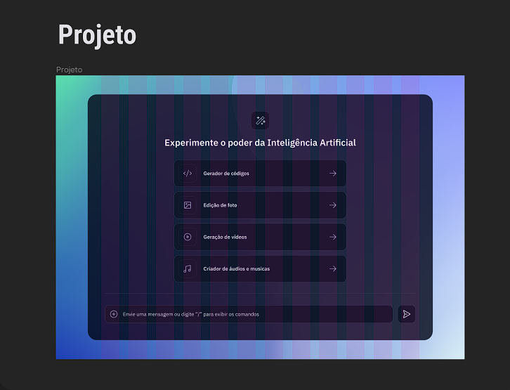

<h1 align="center"> Desafio 28 - Rocketseat </h1>

Desafio proporcionado pela Rocketseat, com o intuito de desenvolver uma tela inicial de uma plataforma de Inteligência Artificial.  

  <a href="#-tecnologias">Tecnologias</a>&nbsp;&nbsp;&nbsp;|&nbsp;&nbsp;&nbsp;
  <a href="#-projeto">Projeto</a>&nbsp;&nbsp;&nbsp;|&nbsp;&nbsp;&nbsp;
  <a href="#-layout">Layout</a>&nbsp;&nbsp;&nbsp;|&nbsp;&nbsp;&nbsp;
  <a href="#-aprendizado">Aprendizado</a>&nbsp;&nbsp;&nbsp;|&nbsp;&nbsp;&nbsp;
  <a href="#memo-licença">Licença</a>

  

 

  

---

## 🚀 Tecnologias

Esse projeto foi desenvolvido com as seguintes tecnologias:

- HTML e CSS
- JavaScript
- Git e Github
- Figma

---

## 💻 Projeto

O 28º desafio do ano, foi desenvolver uma tela inicial de um site, ou aplicação de IA.

<!--[Acesse o projeto finalizado, online](https://Gustavo-Zamai.github.io/dev_links)-->
<!--
- [Assistir aulas](https://lp.rocketseat.com.br/devlinks/inscricao?utm_source=github&utm_medium=descricao&utm_campaign=capture-devlinks&utm_term=organic&utm_content=descricao-github-mayk-brito)
-->

---

## 🔖 Layout

Você pode visualizar o layout do projeto através [Desse Link](https://www.figma.com/file/Ov9xZFaZrZUgbs4oRuekBD/Plataforma-de-IA---Desafio-28-(Community)?node-id=301%3A171&mode=dev). É necessário ter conta no [Figma](https://figma.com) para acessá-lo.

---

## 📑 Aprendizado

Durante esse projeto, reforcei conceitos básicos de HTML, CSS. E utilizei para fixar e melhor compreender sobre o alinhamento e posicionamento dos elementos em diferentes displays, border-radius, e hover em diferentes elementos. 

---

## 📝 Licença

Esse projeto está sob a licença MIT.

---

Feito com ♥ por Gustavo Zamai 🤖 🚀